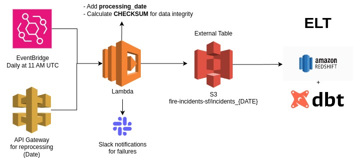
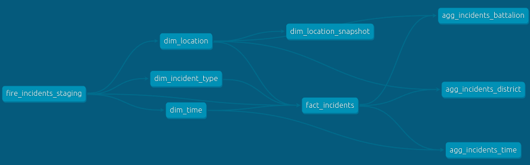

## Introduction
This project uses a modern data stack, leveraging dbt (data build tool) and Amazon Redshift to transform and analyze fire incident data. The architecture is designed to provide scalable, reliable, and efficient data processing capabilities. 

## Architecture and DAGs

## Features explanation

### Checksum for Data Integrity: 
To ensure the accuracy and consistency of the data being loaded and transformed, we've implemented checksum validation. This approach helps in detecting any unintended changes or corruption in the data, thereby maintaining high data integrity standards.

### Slack for Alerting and Monitoring: 
Slack integration is used for real-time alerting and monitoring of the ETL processes. This allows for immediate notification of any issues, errors, or successes in the data pipeline, facilitating quick response and resolution.

### Snapshot for Change Tracking: 
We utilize dbt snapshots to track changes in the dim_location dimension over time. This approach enables historical analysis and understanding of how location-related data evolves.

## Project Structure
The project is organized into two main folders:

**extract**: Contains the AWS Lambda function responsible for extracting fire incident data from the source API and loading it into an Amazon S3 bucket. This function is triggered automatically and ensures that our data lake is always up-to-date.

**fire_incidents**: This is the dbt project folder, where all models, tests, snapshots, and configurations related to the transformation and analysis of fire incident data in Redshift are stored.

## How to use

- AWS Configuration: Ensure that your AWS environment is set up with the necessary permissions for Lambda functions and access to Redshift and S3.

- DBT Setup: Install dbt and configure it to connect to your Redshift cluster. Refer to the dbt documentation for detailed instructions.

- Deploy the Lambda Function: Deploy the Lambda function located in the extract folder to AWS. This function is responsible for fetching and storing data in S3.

- Run DBT Jobs: Navigate to the fire_incidents folder and execute dbt commands to run transformations, tests, and snapshots. Typical commands include dbt run to apply transformations, dbt test to execute data tests, and dbt snapshot to capture changes in dimensions.

- Monitor and Alert: Monitor the process through dbt Cloud or your CI/CD pipeline, and configure Slack notifications for alerts on job statuses and data integrity issues.

## Note

- This project does not use Docker for orchestration or environment management. All components are designed to run in their native environments (Lambda for extraction and Redshift for data warehousing), with dbt facilitating the transformation layer.